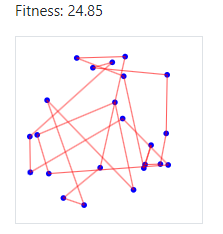

# Genetic Algorithm Simulation 🧬🔬

# [Go to the live simulation](https://erandaniel.github.io/02360664-GeneticAlgorithmsSimulation/)

## note! if you want to update the github-page website run the command "npm run deploy" [for more information: git hub pages tutorial](https://github.com/gitname/react-gh-pages?tab=readme-ov-file)


This project is an interactive React-based web application that simulates genetic algorithms for solving two classic optimization problems: the Traveling Salesman Problem (TSP) and the Knapsack Problem.

## 🌟 Features

- **Interactive Simulation**: Watch genetic algorithms in action!
- **Dual Problem Support**: 
  - 🚗 Traveling Salesman Problem (TSP)
  - 🎒 Knapsack Problem
- **Real-time Visualization**: See the evolution process unfold before your eyes
- **Customizable Parameters**: Fine-tune your genetic algorithm
- **Performance Tracking**: Monitor fitness improvements over generations
- **Top Solutions Showcase**: View the best performers in each generation

## 🖼️ Screenshots

| TSP Simulation | Knapsack Simulation |
|----------------|---------------------|
|  |  |

## 🚀 Getting Started

### Prerequisites
s
- Node.js (v14+ recommended)
- npm (comes with Node.js)

### Installation

1. Clone the repository:
   ```bash
   git clone [repository-url]
   ```
2. Navigate to the project directory:
   ```bash
   cd genetic-algorithm-simulation
   ```
3. Install dependencies:
   ```bash
   npm install
   ```

### Running the Application

1. Start the development server:
   ```bash
   npm start
   ```
2. Open your browser and visit `http://localhost:3000`

## 🎮 Usage

1. **Choose Your Problem**:
   - 🚗 Traveling Salesman
   - 🎒 Knapsack

2. **Adjust Parameters**:
   - Population Size
   - Mutation Rate
   - Crossover Rate
   - Percentage to Evolve
   - Generation Time

   

3. **Start Simulation**:
   - Click "Start" to begin
   - Watch the magic happen!

4. **Monitor Progress**:
   - Track fitness over generations
   - View top solutions in the leaderboard

   

5. **Interact**:
   - Pause/Resume at any time
   - Reset to start over with new parameters or data

## 🧠 How It Works

### Genetic Algorithm Process

1. **Initialization**: Generate random solutions
2. **Evaluation**: Calculate fitness of each solution
3. **Selection**: Choose parents for next generation
4. **Crossover**: Combine parent solutions
5. **Mutation**: Introduce small random changes
6. **Repeat**: keep on evolving (step2, step3...)


### Problem Specifics

#### Traveling Salesman Problem (TSP)
- **Goal**: Find the shortest route visiting all cities once
- **Representation**: Ordered list of city indices
- **Fitness**: Inverse of total route distance

#### Knapsack Problem
- **Goal**: Maximize value of items in a capacity-constrained knapsack
- **Representation**: Binary string (1 = include item, 0 = exclude)
- **Fitness**: Total value of included items (within capacity)


---

Happy evolving! 🧬🚀