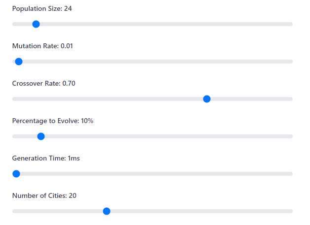
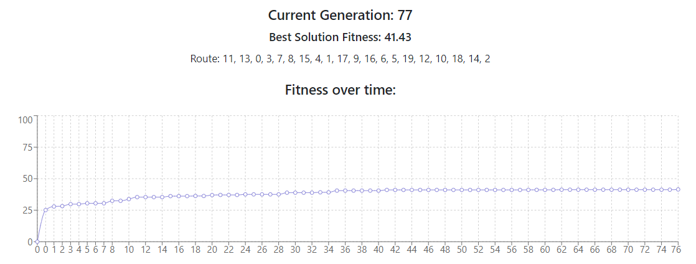
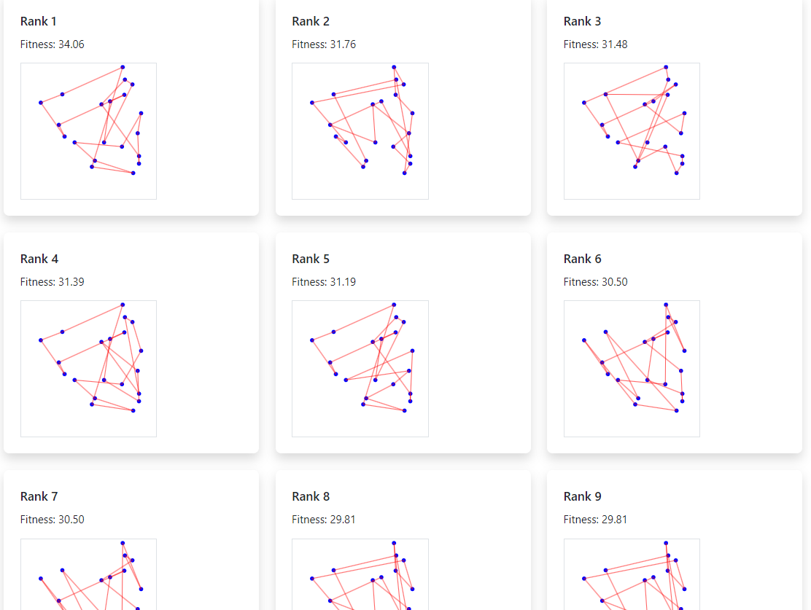
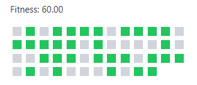

# Genetic Algorithm Simulation - 02360664

# [Link to the live simulation - Click here](https://erandaniel.github.io/02360664-GeneticAlgorithmsSimulation/)


This project is an interactive React web application that simulates genetic algorithms for solving optimization problems: currently supporting TSP and the Knapsack Problem (simple case).


### How Does It Works

1. **Initialization**: Generate random solutions
2. **Evaluation**: Calculate fitness of each solution
3. **Selection**: Choose the best solution as parents for next generation (in this program determent by the "Percentage to Evolve" slider)
4. **Crossover**: Combine parent solutions
5. **Mutation**: Introduce small random changes (determent by the "Mutation rate" slider)
6. **Repeat**:  steps 2, 3, 4...


###  

#### Traveling Salesman Problem (TSP)
- **Goal**: Find the shortest route visiting all cities once
- **Representation**: Ordered list of city indices
- **Fitness**: Inverse of total route distance (because shorter routes are better)

#### Knapsack Problem *(the program simulate a special case where all the items have a "size and value of 1", in this is a case where we for sure know the optimal solution (take all the items)*.
- **Goal**: Maximize value of items in a capacity-constrained knapsack
- **Representation**: Binary string (1 = include item, 0 = exclude).
- **Fitness**: Total value of included items.


## How to use - User

1. **Choose Problem**:
   - Traveling Salesman / Knapsack

2. **Adjust Parameters**:

   

3. **Start Simulation**:
   - Click "Start" to begin

4. **Monitor Progress**:
   - Track fitness over generations.
   - View top solutions in the leaderboard.

   

5. **Interact**:
   - Pause/Resume/Reset at any time.
   - You can also change the parameters to and see how its changes the generations over time.


## How to use - Developer

# note! if you want to update the github-page website run the command "npm run deploy" [for more information: git hub pages tutorial](https://github.com/gitname/react-gh-pages?tab=readme-ov-file)
### Installation

make sure Node.js (v14+ recommended) is installed in your pc!
1. Clone the repository:
   ```bash
   git clone [repository-url]
   ```
2. Navigate to the project directory:
   ```bash
   cd genetic-algorithm-simulation
   ```
3. Install dependencies:
   ```bash
   npm install
   ```

### Running the Application

1. Start the development server:
   ```bash
   npm start
   ```
2. Open your browser and visit `http://localhost:3000`


## Screenshots
| TSP Simulation ||
|----------------|---------------------|



|  Knapsack Simulation ||
|----------------|---------------------|
|  |
